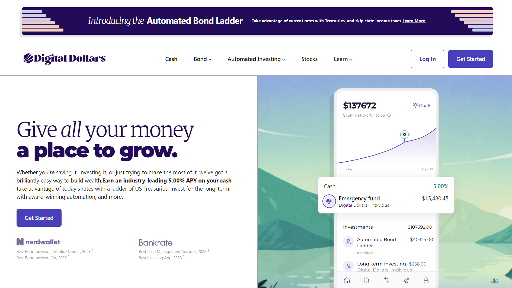
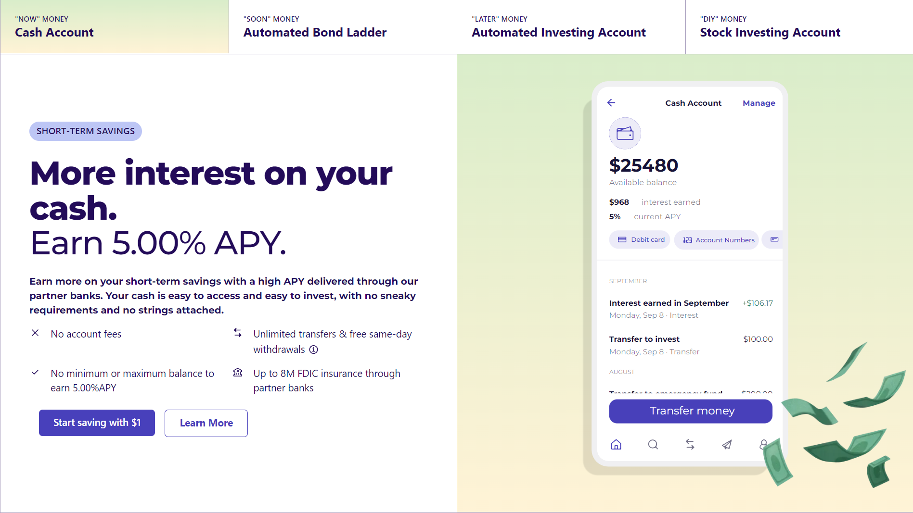
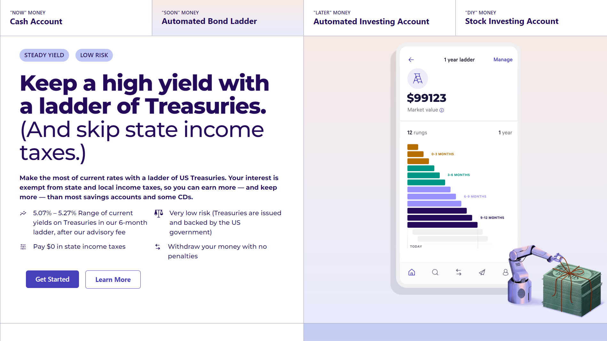
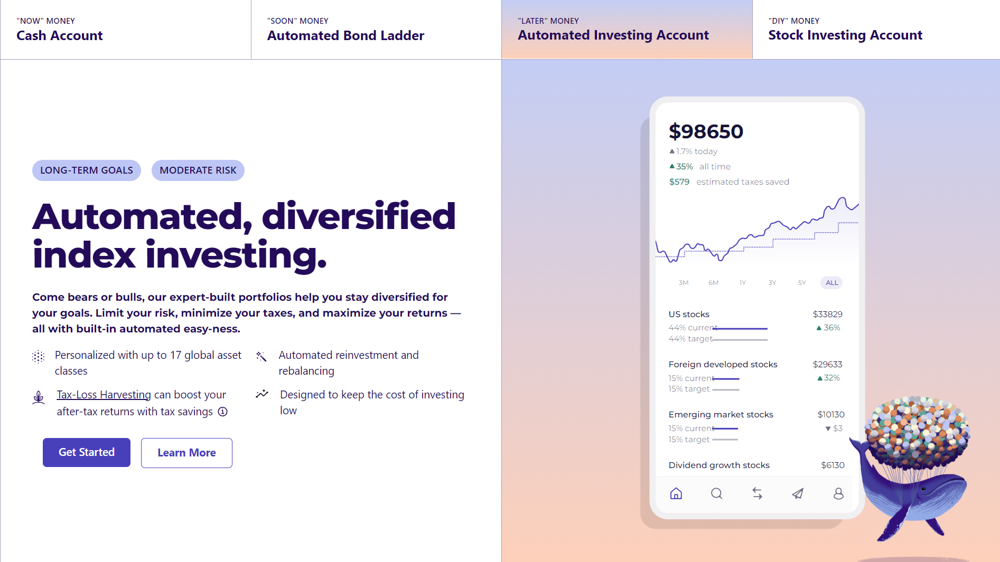
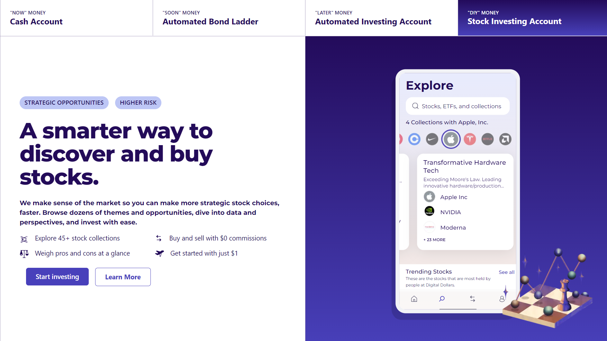
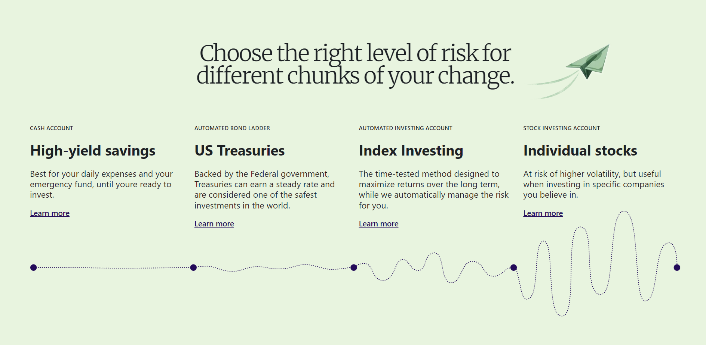
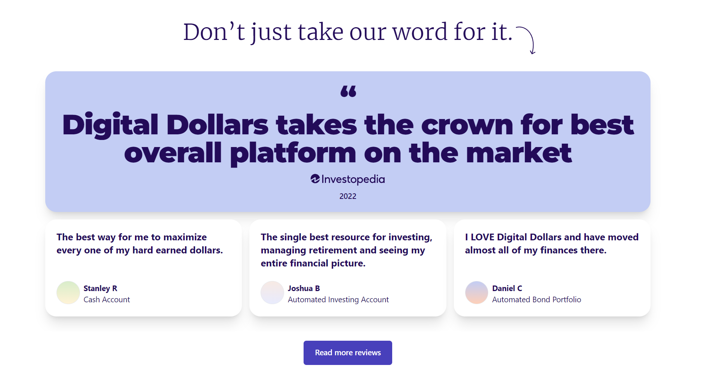
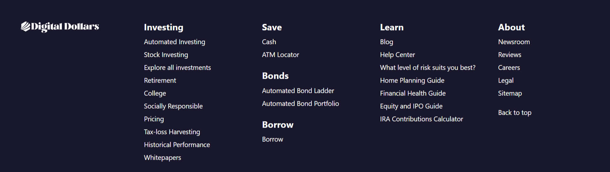

<div align="center">


</div>

---

## Introduction

Welcome to Digital Dollars, a landing page built with React and styled using Tailwind CSS. Digital Dollars is a modern landing page designed to showcase various financial products, including high-yield savings, bond ladders, automated investing, and stock investments.

## Features

- **High-Yield Cash Accounts**: Earn 5.00% APY with no fees or minimum balance.
- **Automated Bond Ladder**: Invest in US Treasuries with tax advantages.
- **Automated Investing**: Diversified portfolios with automated rebalancing and tax-loss harvesting.
- **Stock Investing**: Explore and invest in curated stock collections with $0 commissions.

## Demo

Check out the live demo of this project by clicking the below button:

[](https://digitaldollarsbypb.netlify.app/)


## Screenshots

### Hero Section


### High-Yield Cash Accounts


### Automated Bond Ladder


### Automated Investing


### Stock Investing


### Risk Section


### Testimonials 


### House Section


### Footer



## Installation

To get a local copy up and running, follow these steps:

1. Clone the repository:
   ```sh
   git clone https://github.com/priyanshuahir000/Digital-Dollars.git
   ```
2. Navigate to the project directory:
   ```sh
   cd Digital-Dollars
   ```
3. Install dependencies:
   ```sh
   npm install
   ```

## Usage

To start the development server, run:
```sh
npm start
```
Open http://localhost:3000 to view it in your browser.

## Technologies Used
- React: ^18.2.0
- Tailwind CSS: ^3.4.3
- Vite: ^5.2.0
- Recoil: ^0.7.7
- Radix UI Themes: ^3.0.5
- React Spring: ^9.7.3
- usehooks: ^2.4.1
- Tailwindcss Animated: ^1.1.0
- ESLint: ^8.57.0
- Prettier: ^3.2.5
- PostCSS: ^8.4.38
- Autoprefixer: ^10.4.19

## Contributing

Contributions are what make the open-source community such an amazing place to learn, inspire, and create. Any contributions you make are **greatly appreciated**.

1. **Fork the Project**
2. **Create your Feature Branch** (`git checkout -b feature/AmazingFeature`)
3. **Commit your Changes** (`git commit -m 'Add some AmazingFeature'`)
4. **Push to the Branch** (`git push origin feature/AmazingFeature`)
5. **Open a Pull Request**

## License

Distributed under the MIT License. See `LICENSE` for more information.

## Connect with me

[](https://www.linkedin.com/in/priyanshu-baraiya/)


